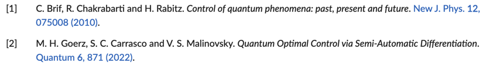

# QuantumCitations.jl

[](https://juliaquantumcontrol.github.io/QuantumCitations.jl/)
[](https://juliaquantumcontrol.github.io/QuantumCitations.jl/dev)
[](https://github.com/JuliaQuantumControl/QuantumCitations.jl/actions)
[](https://codecov.io/gh/JuliaQuantumControl/QuantumCitations.jl)


[QuantumCitations.jl](https://github.com/JuliaQuantumControl/QuantumCitations.jl#quantumcitationsjl) is a fork of [DocumenterCitations.jl](https://github.com/ali-ramadhan/DocumenterCitations.jl) adapted to the conventions of (quantum) physics. It adds support for BibTeX citations in documentation pages generated by [Documenter.jl](https://github.com/JuliaDocs/Documenter.jl), especially the documentation of the packages in the [JuliaQuantumControl organization](https://github.com/JuliaQuantumControl).

By default, [QuantumCitations.jl](https://github.com/JuliaQuantumControl/QuantumCitations.jl#quantumcitationsjl) uses the numeric citation style of the [APS journals](https://journals.aps.org), see the [REVTeX author's guide](https://www.ctan.org/tex-archive/macros/latex/contrib/revtex/auguide).  Citations are shown in-line, as a number enclosed in square brackets, e.g. "Optimal control is a cornerstone in the development of quantum technologies [[1]](#screenshot)."




## Installation

The `QuantumCitations` package can be installed with [Pkg](https://pkgdocs.julialang.org/v1/) as

~~~
pkg> add QuantumCitations
~~~

## Usage

*   Place a BibTeX [`refs.bib`](https://github.com/JuliaQuantumControl/QuantumCitations.jl/blob/master/docs/src/refs.bib) file in the `docs/src` folder of your project.  Then, in [`docs/make.jl`](https://github.com/JuliaQuantumControl/QuantumCitations.jl/blob/master/docs/make.jl), instantiate the `CitationBibliography` plugin and pass it to [`makedocs`](https://documenter.juliadocs.org/stable/lib/public/#Documenter.makedocs):

    ```julia
    using QuantumCitations

    bib = CitationBibliography(joinpath(@__DIR__, "src", "refs.bib"))
    makedocs(bib, ...)
    ```

*   Somewhere in your documentation include a markdown block

    ~~~markdown
    ```@bibliography
    ```
    ~~~

    that will expand into a bibliography for all citations in the documentation.

*   Anywhere in the documentation or in docstrings, insert citations as e.g. `[GoerzQ2022](@cite)`, which will be rendered as "[[2]](#screenshot)" and link to the full reference in the bibliography.

See the documentation for additional features.

## Documentation

The documentation of `QuantumCitations.jl` is available at <https://juliaquantumcontrol.github.io/QuantumCitations.jl>. In addition to documenting the usage of the package, it also serves as its showcase.
